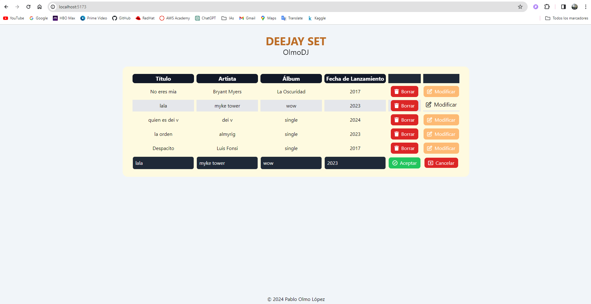

# MusicApp - Gestor de Canciones

## Descripción
MusicApp es una aplicación web diseñada para permitir a los usuarios gestionar una colección de canciones, incluyendo información sobre el título, artista, álbum y fecha de lanzamiento. Facilita la organización y el filtrado de canciones por género y año de lanzamiento.

## Capturas de Pantalla

## Tecnologías Utilizadas
- FastAPI
- Pydantic
- Tailwind CSS
- MongoDB
- Qwik Framework
- Docker

## Vídeo de Demostración
Puedes ver un vídeo de demostración y explicación del proyecto en [este enlace](https://www.youtube.com/watch?v=gn5vw-6liy0).

## Conclusión
Gracias por visitar nuestro proyecto. ¡Tus comentarios y contribuciones son bienvenidos!
  
